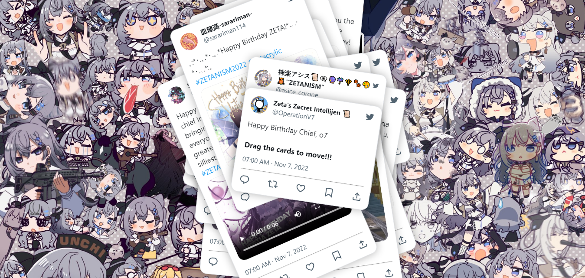

# Vestia Zeta Birthday Wishes

This project is a celebration of Vestia Zeta's birthday, featuring a collection of heartfelt birthday wishes from the community.

With this project, we aim to encapsulate the joy and warmth that Vestia Zeta brings to her audience, and make her birthday truly unforgettable.

## Demo



[Link to Live Demo](https://rizkyaidil.github.io/vestiazeta-birthday-wishes/)

## Installation

To run this project locally, follow these steps:

1. Clone the repository: `git clone https://github.com/rizkyaidil/vestiazeta-birthday-wishes.git`
2. Open the project in a web browser to view the birthday wishes.
3. Interact with the cards by dragging them.
4. Enjoy the birthday messages from the community.

## How to Use

1. **Explaining "tweetData" in tweet.js**

   The heart of this project is the `tweetData` array in the "tweet.js" file. This array contains individual objects, each representing a birthday tweet for Vestia Zeta. You can add, modify, or remove these objects to customize the birthday wishes.

2. **How to Edit "tweetData"**

   To edit or create a birthday tweet, follow these steps:

   - Open "tweet.js" in your code editor.
   - Locate the `tweetData` array.
   - Add a new object to the array to create a new birthday tweet. Here's an example:

     ```javascript
     {
       "id": 1,
       "img": "your-image.png",
       "name": "Your Name",
       "username": "@yourusername",
       "tweet": "Your heartfelt birthday message."
     }
     ```

   - Modify the properties with your own content.
   - Save the file.

3. **How to Add "tweet-img" and "tweet-video"**

   To add an image or video to your birthday tweet, follow these examples:

   - **How to Add "tweet-img":**

     In your tweet object, simply add the "tweet-img" property with the filename and extension of the image you want to attach:

     ```javascript
     "tweet-img": "your-image.jpeg"
     ```

   - **How to Add "tweet-audio":**

     In your tweet object, include the "tweet-video" property with the filename and extension of the video file you want to include:

     ```javascript
     "tweet-audio": "your-audio.mp4"
     ```

4. **Formatting Birthday Wishes:**

   When adding your heartfelt birthday message to the "tweetData" array, you can customize the formatting to make your message more special. Here are some tips:

   - To add a new line in your message, use the `<br>` HTML tag.
     For example:
     ```javascript
     "tweet": "Wishing you a wonderful birthday!<br>May your day be filled with joy and happiness."
     ```

   - To include hashtags in your message, use the `<a>` HTML tag.
     For example:
     ```javascript
     "tweet": "Happy birthday to the amazing Vestia Zeta! <a>#BirthdayWishes</a> <a>#Celebration</a>"
     ```

## Credits

Background: [Sarariman114](https://twitter.com/sarariman114)

Video: [Shalltr's TikTok](https://www.tiktok.com/@shalltr) and [XXKokobop's TikTok](https://www.tiktok.com/@xxkokobop)

Other Assets:
Favicon, profile images, tweet images, tweet video and audio used in this project can be found in the "credits.md" file within the project repository.

## Contributing

We welcome contributions from the community to make this project even more special! Here's how you can contribute:
- Fork this repository.
- Create a new branch for your feature or bug fix.
- Submit a pull request.

## Contact

If you have any questions or feedback, feel free to reach out to [Rizky Aidil](mailto:hi.rizkyaidil@gmail.com).